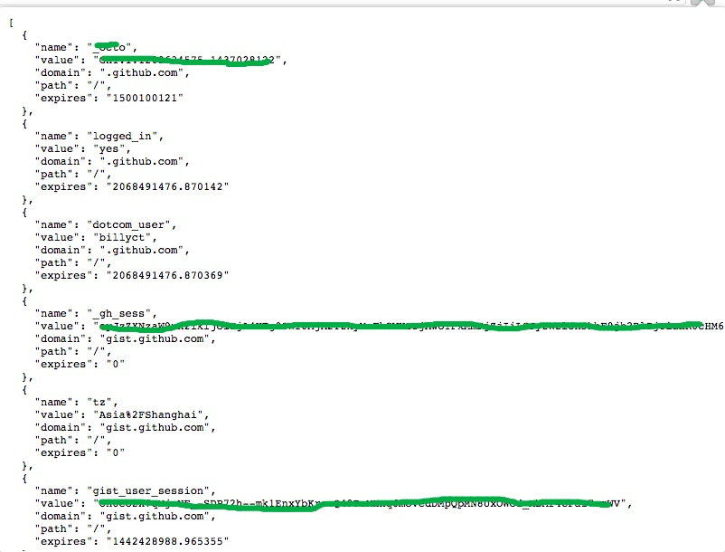

# cookies_json_chrome_extension

[中文](https://github.com/billyct/cookies_json_chrome_extension/blob/master/readme_zh.md)

a chrome extension show json style cookies, it's useful for you test some web programs

### setup
* ```$ git clone https://github.com/billyct/cookies_json_chrome_extension.git```
* open your chrome and open the url ```chrome://extensions/```
* load unpacked extension where you just cloned（note:open your dev mode）

### screenshot




### thx
Inspired by the chrome extension [cookies.txt](https://chrome.google.com/webstore/detail/cookiestxt/njabckikapfpffapmjgojcnbfjonfjfg)
